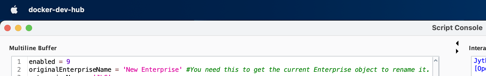

#	MES Ignition Development Using Docker

## Getting Started

###  Apple Silicon Mac 

*	Download Docker Desktop 
		https://www.docker.com/products/docker-desktop/ 

*	Choose Apple Chip
	*	

*	Drag and Drop Docker to Application Folder
	*	

Open Docker Desktop to initialize 

## Install Ignition (8.1.28) Hub and Spoke & SQL Database (Azure SQL Edge)
*	Docker Compose Hub and Spoke Command
```bash
ignition % docker compose up -d
```

## Download Azure Data Studio
*	[Azure Data Studio (Apple Silicon)](https://go.microsoft.com/fwlink/?linkid=2242554)
*	Add ***localhost*** server to Azure Data Studio
	*	Use the following login details to connect to the database

|  |  |
|--|--|
| Server | localhost |
| User name | sa |
| Password | yourStrong(!)Password |
| | |


*	Right click on Database and add New Database ***SCADA***, ***MES*** and ***MES_ENT***
	

#	Setup Ignition Gateways

## Database Connection amd Sepasoft Module Configuration

* 	Configure database **Connect URL** `jdbc:sqlserver://mssql`
	
###	Spoke
* Launch Spoke Gateway and Configure database connections for ***SCADA*** and ***MES***  
http://localhost:9088/web/config/database.connections

	

*	Config `->` Mes `->` ***MES Module Settings*** 
	*	Choose MES for ***Runtime Database*** and ***Analysis Database*** then save changes.
	

### Hub
* Launch Hub Gateway and Configure database connections for ***SCADA*** and ***MES_ENT***  
http://localhost:9888/web/config/database.connections

	

*	Config `->` Mes `->` ***MES Module Settings*** 
	*	Choose MES_ENT for ***Runtime Database*** and ***Analysis Database*** then save changes.
	


## Sepasoft Constituting Hub and Spoke

## Open Designer
*	Open Hub `http://localhost:9888` using Ignition Designer and use this python code in the script console.

```python
enabled = 1
originalEnterpriseName = 'New Enterprise' #You need this to get the current Enterprise object to rename it. 
enterpriseName = 'JLG'
siteName = 'McConnellsburg'
areaName = 'McConnellsburg Assembly'
processCellName = 'McConnellsburg Final Assembly Processes' 
unitName = '50005'
phaseClassMain = '0000347'
phaseClassDocs = 'EQC Phases'
unitClass = '50005' 
recipeClassName = 'Master Routes'
# ON HUB
if enabled == 1:
	eqpLink = system.mes.getMESObjectLinkByName('Enterprise',originalEnterpriseName) 
	eqp = eqpLink.getMESObject()
	eqp.setName(enterpriseName)
	eqp.save()
# ON HUB
if enabled == 2:
	eqp = system.mes.createMESObject('Site')
	eqp.setName(siteName)
	eqp.setEquipmentPath(enterpriseName+'\\'+siteName)
	eqp.setActive(True)
	parentLink = system.mes.getMESObjectLinkByName('Enterprise',enterpriseName) 
	parent = parentLink.getMESObject()
	eqp.addParent(parent)
	eqp.save()
# ON HUB
if enabled == 6:
	phaseRoot = system.mes.batch.phase.getRootLink()
	eqcPhaseClass = system.mes.batch.phase.createClass(phaseClassMain, phaseRoot) 
	eqcPhaseClass.save()
	eqcPhasesPhaseClass = system.mes.batch.phase.createClass(phaseClassDocs, phaseRoot) 
	eqcPhasesPhaseClass.save()
# ON HUB
if enabled == 7:
	unitClassRoot = system.mes.batch.unitclass.getRootLink()
	unitClass = system.mes.batch.unitclass.create(unitClass, unitClassRoot) 
	noActionPhaseLink = system.mes.batch.phase.getPhaseLink('No Action') 
	unitClass.addPhase(noActionPhaseLink)
	unitClass.save()
# ON HUB
if enabled == 8:
	unitLink = system.mes.batch.unit.getLink(unitName) 
	unitClassLink = system.mes.batch.unitclass.getLink(unitClass) 
	system.mes.batch.unit.assignUnitClass(unitLink, unitClassLink)
# ON HUB
if enabled == 9:
	rootRecipeLink = system.mes.batch.recipe.getRootRecipeLink()
	recipeClass = system.mes.batch.recipe.createRecipeClass(recipeClassName,rootRecipeLink) 
	recipeClass.save()
```
*	Execute code in script console: 
	* Run script `enabled = 1`
	
	* Run script `enabled = 2`
	
	*	Verify script worked by launching the Hub MESGateway project and checking the MES Equiptment Manager
			
* 	Connect Gateway Network
	*	Config `->` NetworkGateway `->` Network Settings `->` Incoming Connections
	* Approve Connection
	
	* Approve Again
	
	
	* After Approving the second time your page should look like this. 
	

* 	Config `->` Mes `->` ***Enterprise Settings*** 
	*	Set as **Enterprise Root** then save changes.
	

* On the Spoke http://localhost:9088/web/config/mes.enterprisesettings Enterprise Settings `->` Hierarchy `->` Parent Gateway `->` choose ***Parent Gateway*** and type `McConnellsburg` under **Equipment Name**.

	* Click on Add Equipment
		
		*	Click OK on the popup!
			
		#### SAVE CHANGES

	*	Verify Spoke has Synced Hub Equiptment 
	
## Open Designer
*	Open Spoke `http://localhost:9088` using Ignition Designer and use this python code in the script console.	

```python
enabled = 3
originalEnterpriseName = 'New Enterprise' #You need this to get the current Enterprise object to rename it. 
enterpriseName = 'JLG'
siteName = 'McConnellsburg'
areaName = 'McConnellsburg Assembly'
processCellName = 'McConnellsburg Final Assembly Processes' 
unitName = '50005'
phaseClassMain = '0000347'
phaseClassDocs = 'EQC Phases'
unitClass = '50005' 
recipeClassName = 'Master Routes'
# ON spoke
if enabled == 3:
	eqp = system.mes.createMESObject('Area')
	eqp.setName(areaName) 
	eqp.setEquipmentPath(enterpriseName+'\\'+siteName+'\\'+areaName) 
	eqp.setActive(True)
	parentLink = system.mes.getMESObjectLinkByName('Site',siteName) 
	parent = parentLink.getMESObject()
	eqp.addParent(parent)
	eqp.save()
#ON spoke
if enabled == 4:
	eqp = system.mes.createMESObject('ProcessCell')
	eqp.setName(processCellName) 
	eqp.setEquipmentPath(enterpriseName+'\\'+siteName+'\\'+areaName+'\\'+processCellName) 
	eqp.setActive(True)
	parentLink = system.mes.getMESObjectLinkByName('Area',areaName)
	parent = parentLink.getMESObject()
	eqp.addParent(parent)
	eqp.save()
# ON spoke
if enabled == 5:
	eqp = system.mes.createMESObject('Unit')
	eqp.setName(unitName) 
	eqp.setEquipmentPath(enterpriseName+'\\'+siteName+'\\'+areaName+'\\'+processCellName+'\\'+unitName) 
	eqp.setActive(True)
	parentLink = system.mes.getMESObjectLinkByName('ProcessCell',processCellName)
	parent = parentLink.getMESObject()
	eqp.addParent(parent)
	eqp.save()
```
*	Run Script `enabled = 3`
	
*	Run Script `enabled = 4`
	
*	Run Script `enabled = 5`
	

*	Verify script worked by launching the Hub MESGateway project and checking the MES Equiptment Manager
	

* Open Hub Designer Script Console
	* Run Script `enabled = 6`
	
	* Run Script `enabled = 7`
	
	* Run Script `enabled = 8`
	
	* Run Script `enabled = 9`
	
> Written by [Scott Johnson](https://github.com/IlScottlI).